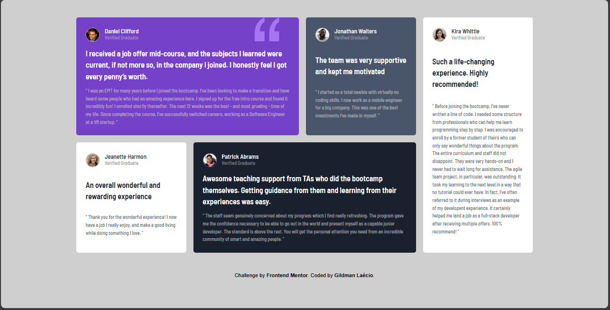
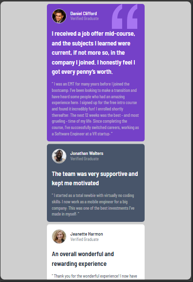
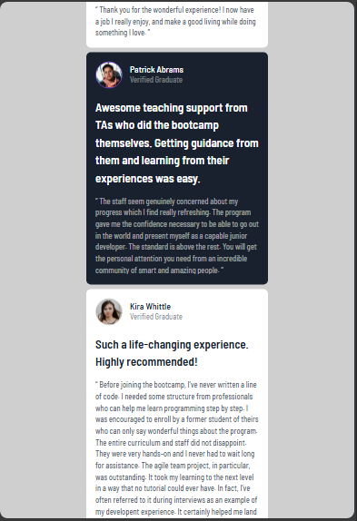

# testimonials-grid-section-main
 testimonials-grid-section-main


This is a solution to the [Testimonials-grid-section-main challenge on Frontend Mentor](https://www.frontendmentor.io/learning-paths/building-responsive-layouts--z1qCXVqkD/steps/674c6af692fdd6803ca679df/challenge/start). Frontend Mentor challenges help you improve your coding skills by building realistic projects. 

## Table of contents

- [Overview](#overview)
  - [Screenshot](#screenshot)
  - [Links](#links)
- [My process](#my-process)
  - [Built with](#built-with)
  - [What I learned](#what-i-learned)
  - [Continued development](#continued-development)
- [Author](#author)

## Overview

### Screenshot

These are my screenshots showing how the project turned out.

- For desktop version:



- For mobile version:






### Links

- Solution URL: [My Solution](https://gillaercio.github.io/testimonials-grid-section-main/)

## My process

### Built with

- Semantic HTML5 markup
- CSS custom properties
- Grid Layout
- Mobile-first workflow

### What I learned

I took advantage of this project to practice the use of **Grid Layout**:

Positioned background

```css
.featured-section {
  background: url(../images/bg-pattern-quotation.svg) var(--moderate-violet) no-repeat;
  background-size: auto;
  background-position: 90% top;
}
```

Grid-area in large screens

```css
@media screen and (width > 1439px) {
  #content {
    align-content: center;
    display: grid;
    grid-template-columns: repeat(4, minmax(auto, 1fr));
    max-width: 1960px;
    grid-template-areas: 
    "feature-content feature-content top-content sidebar-content"
    "left-content middle-content middle-content sidebar-content";
  }

  .cards:nth-child(1) {
    grid-area: feature-content;
  }

  .cards:nth-child(2) {
    grid-area: top-content;
  }

  .cards:nth-child(3) {
    grid-area: left-content;
  }

  .cards:nth-child(4) {
    grid-area: middle-content;
  }

  .cards:nth-child(5) {
    grid-area: sidebar-content;
  }
}
```

### Continued development

I would like to improve the use of **Grid layout** in conjunction with media queries.

## Author

- Frontend Mentor - [@gillaercio](https://www.frontendmentor.io/profile/gillaercio)
- Github - [My Github](https://github.com/gillaercio)
- LinkedIn - [My LinkedIn](https://www.linkedin.com/in/gildman-la%C3%A9rcio/)